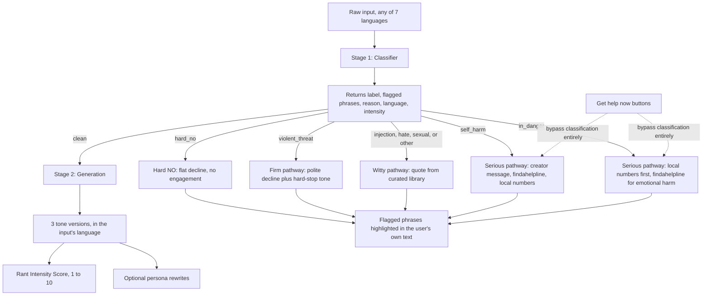

# T-Rant 🦖

**They probably deserved it.**

Paste a heated draft message - a Slack rant, an angry email - and get back three versions at different diplomacy levels, so you can pick one and actually send it instead of the original.

"Angry message → professional rewrite" tools already exist (Angry Email Translator, Anger Translator, AI Corporate Translator, among others). What's different here is two things: a guardrail architecture with dedicated, isolated safety classification, not three prompt variations bolted onto an unguarded text box, and a deliberate bet on **provable transparency** over "trust us": every block shows you exactly what tripped it, in your own words.

A handful of bonus features and independent verification of a couple of content sources are still ahead (see [The full experience](#the-full-experience-planned) below) - everything else described here, including the pixel-art T-Rex identity, the self-harm calming redesign, unwind links, and screenshot branding, is built and working today.

**2026-08-19 design pass:** a full visual/UX redesign - one unified typeface site-wide (the retro pixel font used to appear on headers, now dropped entirely - see Visual & sound identity below), a persistent left-nav app shell with the current page highlighted (House Rules and the other utility pages get their own sidebar slot instead of being buried in body copy), a quieter ambient background in place of the busier repeating pixel pattern, a bigger hero Rex, and a rebuilt in-danger support flow (see Guardrail categories and Transparency & trust below). A same-day follow-up pass turned the serious pathway into a true modal (click-outside or Escape to exit, not just the Back button), rebuilt House Rules as a topic-grouped collapsible accordion with two new entries (classifier limitations, using this on a monitored work device), rewrote the Bookmarklet page for non-technical readers, and fixed a real bug in the live classifier (`max_tokens` was occasionally too tight, silently truncating the "why was this blocked" explanation - see Guardrail categories). A second same-day pass swapped Geist Sans for Space Grotesk (more character, still fully readable) and the orange/brown accent color for a deep teal, added a standalone `/unwind` page and a mock-mode badge on the home page, and rewrote the House Rules tone-ladder example so even the least-diplomatic tier reads as something you'd actually send a colleague. Functional guardrail *categorization* logic is unchanged throughout; see `git log` for the full list.

**2026-08-21 pass: modes, a shorter default page, and sound.** Three new sitewide modes, each backed by a shared React context (`UIState.tsx`): **dark mode** (a full dark token palette, toggled or system-detected, persisted - previously the site forced light even against a dark OS preference), **density** (Gmail-style compact/comfortable spacing, persisted), and **stealth mode** (one click disguises the entire page as a generic gray "Notes" app - grayscale filter, swapped title and branding, de-emojified nav - deliberately *not* persisted, since a saved flag would undercut the point). A fourth mode, **reader mode** (`?reader=1`), strips the page down to just the textarea and the result, no sidebar or branding. The result view now starts collapsed behind a "Show my rewrite" button; revealing it shows only Professional & Clear plus an expander for the other two tones and Director's Cut, personas collapse behind "More tones," and the unwind links/privacy footer collapse behind "Learn more" - all aimed at a shorter page by default (see Status below for the rest: rotating loading messages, a confetti burst on clean results, new sound effects, and more). None of this touches the self-harm/in-danger pathway, which stays exactly as unbranded as before.

## Architecture



Two-stage pipeline, not one prompt trying to classify and respond at once: a dedicated classification pass is much harder to talk past than a single prompt juggling both jobs. Stage 2 only ever runs on inputs Stage 1 has already cleared, and never sees the raw verdict as something to second-guess. Personas (see below) re-run the classifier independently before generating anything - they never trust a client's claim that text is already safe.

We don't claim this is unhackable anywhere: the defensible claim is the layered architecture itself (an isolated classification pass, a generation step that never sees a raw verdict to second-guess), not a bulletproof guarantee. It also isn't a claim that the classifier catches everything - see the dedicated House Rules entry on that, linked under Transparency & trust below.

**Bug fixed 2026-08-19:** the classifier's `max_tokens` was set to 100, which for longer flagged phrases occasionally ran out of budget mid-tool-call and silently truncated the `reason` field to an empty string - a real user report ("the blocker didn't catch X") turned out, on live-testing against the real API, to be `MOCK_MODE` (a crude regex stand-in, see Running locally below) rather than a live-classifier miss, but this token-budget issue surfaced during that investigation and was a genuine reliability bug in the live classifier's explanation output. Raised to 300 in [`classifier.ts`](app/src/lib/classifier.ts).

## The three tiers

1. **Still You, Just Cooler**: firm and direct, still clearly the least-hedged tier, but corporate-safe - no profanity, no "you never..." accusations, nothing that reads as unhinged, no fake pleasantries either. Keeps every detail from the input, including tangential ones - only the wording changes, not the content. The generator prompt frames it as "a highly competent employee barely holding their frustration together, choosing every word carefully enough that nobody could screenshot it and report it to HR."
2. **Professional & Clear**: standard workplace-diplomatic tone, direct but appropriate for a manager or client. Also edits content, not just tone: drops specific side comparisons or accusations that read as inflammatory or oversharing (e.g. "you're getting a commission and I don't") while keeping the underlying concern.
3. **Maximum Diplomacy**: heavily softened, hedge-heavy, prioritizes preserving the relationship over directness. Same content-editing as Professional & Clear, plus more hedging.

Each of the three tiers comes with a **one-sentence explanation** of what changed and why (e.g. "Removed the swearing and the pay comparison; kept the deadline concern front and center") - generated alongside the rewrite itself, not a separate pass.

There's also a fourth version, **Director's Cut**: the rawest, most emotionally honest take, explicitly for the sender's own eyes only - never meant to be sent. It can be blunt and use mild profanity (catharsis, not communication) but still can't cross into slurs, name-calling, threats, or genuine cruelty toward the other person. Hidden behind a click by default, and structurally excluded from the shareable-link payload (a separate field from the other three versions, not a fourth key alongside them) so it can never end up copied or shared by accident.

Plus five optional **persona rewrites** for fun/sharing, generated on top of an already-clean message: Corporate Memo, Victorian Letter, Cease & Desist, Haiku, Nature Documentary.

## Transparency & trust

The throughline for everything below: don't just claim something's safe or private, make it checkable.

- **Every block shows its work.** When a message is blocked, the response echoes your own text back with the exact triggering phrase(s) highlighted, plus a one-line reason with the phrase quoted inline: never a vague category label.
- **Live rate-limit counter** on every response ("7 of 10 rants left this hour"), never a silent cutoff.
- **Privacy statement with a verifiability pointer**, not just a promise: the site links straight to [`src/lib`](app/src/lib) so anyone can read the actual logging code (only category and timestamp, ever - raw text is never persisted).
- **[House Rules](app/src/app/house-rules/page.tsx) page**: precise definitions of the three tones, example phrases per flagging category, a live sandbox that runs the real classifier with no rewrite generated, and the full privacy/legal breakdown - laid out as a collapsed-by-default accordion (native `<details>`, accessible for free), grouped under three topic headings (Using T-Rant / Privacy & Safety / The Fine Print) so the list of questions itself is the at-a-glance overview. Includes two entries worth calling out on their own: an explicit, unhedged statement that this classifier - mock locally, a real model in production - **cannot catch every possible threat and this is not a safety product**, and a note on what using the site on a company-managed device does and doesn't change about privacy.
- **Mock-mode badge**: a small "🧪 Mock mode" pill on the home page whenever `MOCK_MODE=true` is active server-side (checked via a tiny `/api/mode` endpoint on load). Added after mock output was twice mistaken for a real-pipeline bug - now it's visible at a glance instead of requiring a look at `.env.local`.
- **[Dark Pattern Audit](app/src/app/dark-patterns/page.tsx)**: a satire page mocking how a typical app would monetize this exact tool, kept as a public receipt against ever actually doing it. The "none of this is real" disclaimer is its own visually distinct paragraph, not buried mid-sentence.
- **["Get help now" buttons](app/src/app/page.tsx)**, always visible just below the form as a quiet text line (not a bordered callout - noticeable without competing with the actual product): no classifier, however well-tuned, catches every phrasing, so there's a direct, one-tap path to real help that doesn't depend on the classifier working at all, and doesn't require typing or explaining anything first. Language for the response is read from whatever you've typed, if anything; otherwise it defaults to English rather than guessing from browser/OS locale, which turned out to be an unreliable signal for what language someone's actually reading in.
- **Calm-mode focus, as a true modal**: triggering either help-now button (or the classifier landing on `self_harm`/`in_danger` itself) hides the rest of the page - hero, form, and nav disappear, replaced by a full-viewport backdrop in a distinct calm color, deliberately not just the site's normal palette with the lights turned down - so the support response is the only thing on screen. Three ways out, all equally available: a "Back to T-Rant" button on the card, clicking anywhere outside it, or pressing Escape.
- **Persistent left-nav sidebar** (all pages): Unwind Links, House Rules, and Dark Pattern Audit get the top slots, then a divider, then Emergency Numbers and the Bookmarklet - each with its own emoji, current page highlighted. Also carries the dark-mode and density toggles, and (home page only) a dismissible "rant haiku of the day."

## Guardrail categories

| Input reads as | Pathway | Behavior |
|---|---|---|
| Ordinary venting/frustration | **Clean** | Full three-tier rewrite, Rant Intensity Score, optional personas |
| CSAE, trafficking, extremist content, doxxing, fraud, weapons instructions, actual crime planning | **Hard NO** | Flat, immediate decline. No engagement, no cleverness. |
| Self-harm, suicidal ideation, or eating-disorder content | **Serious (self-harm)** | No mascot, no jokes, no screenshot branding. Calming visual treatment (warm beige, muted sage/soft blue, nothing bright or saturated), elevated card layout. A longer, creator-written message with practical things that helped, findahelpline.com, and the local-emergency-number picker as a secondary reference. Biased toward over-flagging rather than under-flagging. |
| Disclosure of being harmed by someone else (including indirect phrasing, not just literal trigger words) | **Serious (in danger)** | Same calming treatment. Redesigned 2026-08-19: opens by naming the ambiguity - this could mean immediate physical danger or ongoing emotional harm, and T-Rant isn't equipped for either - then leads with the local-emergency-number picker (immediate danger first), with findahelpline.com presented second, reframed specifically for being hurt or controlled without immediate danger. |
| Specific, credible threat of violence against a named real person (including euphemistic/indirect phrasing) | **Firm** | Polite, on-brand decline, paired with a distinct hard-stop audio tone: not comedic. |
| Prompt-injection attempts, hate speech, sexual content, other off-purpose use | **Witty** | Declines the request, pairs it with a quote picked server-side from a curated library (so it can't be tampered with client-side). |

## Multilingual support

Supported: **English, German, Spanish, Italian, French, Swedish, Russian.** The classifier detects the input's language and the whole per-request response follows it:

- The 3 tone rewrites and persona rewrites: generated live, in the detected language.
- The classifier's flagged-phrase reasoning: generated live, in the detected language.
- The self-harm/in-danger support text: **static, pre-translated per language** (not live-generated), since getting a crisis message's wording slightly wrong matters more than getting a rewrite's wording slightly wrong. Translated by Claude. A 2026-08-17 Claude review pass checked every translation for grammar, naturalness, and safe-messaging conventions (no "committed suicide"-style phrasing, no methods/means, no minimizing, always paired with a real resource link) and found no issues - confidence is high for German/Spanish/Italian/French, moderate for Swedish/Russian. A human native-speaker pass is still recommended before this is treated as fully signed off, especially for Swedish/Russian: an AI reviewing its own prior output isn't a substitute for that. The in-danger copy was rewritten and re-translated into all 7 languages on 2026-08-19 (see [`selfHarmContent.ts`](app/src/lib/selfHarmContent.ts)); same AI-translated-pending-human-review status as the rest of this file.
- The witty-pathway quotes: a separate, smaller **20-quote curated set per non-English language** (not a machine translation of the English 86), preferring standard/canonical translations for scripture and classical citations over fresh retranslation. The same 2026-08-17 review pass spot-checked citations against known canonical wording and attributions and found no issues; same native-speaker caveat applies.

Deliberately **not** translated: House Rules, site chrome, `/dark-patterns`, this README. The tool's actual output meets you in your language; the scaffolding around it doesn't need to yet.

## Sharing

- **Share on X**: opens a pre-filled tweet via `twitter.com/intent/tweet`, no OAuth, no API key. The app never touches your account.
- **Copy shareable link**: encodes only the *rewritten output* (never your original draft) into the URL. No backend storage.
- **Auto-generated Open Graph image**: code-generated at request time ([`opengraph-image.tsx`](app/src/app/opengraph-image.tsx)), so shared links get a real preview card.
- **[Bookmarklet](app/src/app/bookmarklet/page.tsx)**: highlight text anywhere in your browser, click the bookmark, land on T-Rant with it pre-filled. Its own page explains what it is in plain language for a non-technical reader, is explicit that the highlighted text ends up in your browser's own local history the same as any URL you visit (not just "briefly", which the copy used to imply), and has a dedicated note on what using it on a company-managed device does and doesn't change - mirrored in House Rules.
- **Screenshot branding**: the input box and every non-serious result render inside a bordered card with a "🦖 T-Rant" band at both the top and bottom, so a manual screenshot carries the mark no matter where someone crops it.

## Visual & sound identity

Code-generated pixel art and a warm, muted color palette, no external image assets anywhere in this section. **2026-08-19:** the retro pixel display font (previously used on the brand mark and section headers) was dropped in favor of one typeface everywhere - it read as inconsistent across sections, and the pixel-art sprite already carries the retro identity on its own without needing the type to match. The "small arms" joke framing was also dropped from all copy (it read as a joke at the expense of people with limb differences); the tagline is now "Big feelings. Smart translation." Later the same day, that one typeface changed again: [Space Grotesk](https://fonts.google.com/specimen/Space+Grotesk) replaced Geist Sans (more visual character, still fully readable at body-copy sizes), and the accent color moved from an orange/brown to a deep teal (`#2b6e63`) - the orange read too close to a caution color for how often it appeared as the primary button/nav-highlight color.

- **Pixel T-Rex sprite** ([`lib/rexSprite.ts`](app/src/lib/rexSprite.ts)): one shared 18x14 silhouette with a distinct pose per tone/pathway - raised eyebrow for Still You Just Cooler, a necktie for Professional & Clear, an olive branch for Maximum Diplomacy, a stomping animation while a request is in flight, a stop sign plus a small meteor for witty-pathway blocks. Rendered large in the home page hero (a slow, gentle bob, distinct from the quick loading-state stomp) as the page's main visual anchor. Deliberately **no sprite at all** for Hard NO or the serious (self-harm/in-danger) pathway - those stay unbranded on purpose, per the guardrail design.
- **Square-wave sound effects** ([`lib/sounds.ts`](app/src/lib/sounds.ts)): oscillator-generated, not licensed audio files. A stomp on submit, a distinct click-triggered blip per tone (click a tone heading to hear it), a three-note roar when you click the hero Rex, an ascending success chime on a clean result, a soft tick synced to the rotating loading message, the hard-stop tone for firm blocks, a "womp womp" for witty blocks. Silent by design for hard_no and the serious pathway.
- **Pixel favicon** ([`icon.tsx`](app/src/app/icon.tsx)): the same sprite geometry, server-rendered, so it can't drift from the in-app sprite.
- **Ambient background**: two soft, low-opacity glow blobs in far corners plus one smooth horizon silhouette along the bottom edge - a quieter replacement for an earlier repeating pixel-fern/volcano pattern, which read as visually busy rather than atmospheric at full scale. Hidden during the serious pathway, same as before.

## Extras

- **Optional dialogue-context field**: a "What set this off? (optional)" box below the main textarea, so a rewrite can respond to the other side's specific point instead of just neutralizing tone in a vacuum. Whatever's typed there is classified right alongside the main message (clearly labeled, not silently appended) before anything gets generated, so it can't be used to smuggle disallowed content past the guardrail just because it's in a second box.
- **Writing-style guidance**: a short callout above the textarea contrasting a description of the feeling ("I feel really annoyed that Steve keeps eating all the snacks...") with the actual message to paste ("STEVE. You absolute Brontosaurus...") - the tool only works well on the latter, and that wasn't obvious without saying so.
- **Rant Intensity Score**: 1-10 rating of how heated the input reads, returned by the classifier alongside its label.
- **Rage thermometer**: a client-side-only heuristic meter that fills as you type, before you even submit (no API call).
- **[Unwind links](app/src/lib/unwindLinks.ts)**: a curated set of links (Tetris, explore.org, r/aww, The Useless Web, 2048, Wordle) shown after any response except the serious pathway, for stepping away instead of continuing to engage - introduced by a short Rex-branded heading ("🦖 Rex-commended: a few minutes of doing absolutely nothing productive") explaining what the section actually is. Also reachable directly from the sidebar at [`/unwind`](app/src/app/unwind/page.tsx), added 2026-08-19 so they don't require submitting a rant first.
- **[Emergency numbers reference](app/src/app/emergency-numbers/page.tsx)**: a region-then-country dropdown showing a general emergency phone number, available standalone and embedded in the serious pathway - as the lead resource for in_danger (immediate physical danger comes first in that flow, see Guardrail categories above), as a secondary reference alongside `findahelpline.com` for self_harm. Most countries also show smaller-font secondary numbers (non-emergency police, domestic-violence hotlines, poison control, etc.) where there was reasonable confidence in a real, stable number - these double as the practical answer for "hurt by someone, no immediate danger" in the in_danger flow, once a country is picked. All 35 entries were cross-checked against Wikipedia's "List of emergency telephone numbers" plus targeted searches on 2026-08-17 (one real correction came out of it: India's ambulance figure, 102 → 108) and each shows its "last verified" date in the UI. Built instead of IP-based geolocation, which was explicitly ruled out. See the maintenance note in [`emergencyNumbers.ts`](app/src/lib/emergencyNumbers.ts) for how to re-verify going forward.
- A couple of things are hidden in here too. You'll know it when you find one.

## The full experience (planned)

The pipeline, safety architecture, transparency features, multilingual support, sharing, and visual/sound identity described above are all built and working. The rest of the intended experience is still ahead:

**Geo-routing.** Explicitly decided against: IP-based geolocation was ruled out in favor of the user-picked region/country dropdown described under Extras, wired into the serious pathway (see Guardrail categories above for how self_harm and in_danger use it differently; the emergency-numbers dropdown covers general emergency services, not crisis lines specifically). All 35 entries are independently verified as of 2026-08-17.

**Bonus features:** Director's Cut and diff-style explanations (see "The three tiers" above) are both built. None currently under consideration.

## Status

**Shipped:** core two-stage pipeline, all five pathways, transparency features (including an accordion-format House Rules page), House Rules with a live classifier sandbox, multilingual classification/generation/self-harm-content/quotes, Rant Intensity Score, five personas, rage thermometer, pixel-art T-Rex visual identity with per-pose sprites/sound/favicon/background, sharing (X intent, output-only permalinks, OG image, screenshot branding), self-harm calming visual redesign, unwind links, emergency-numbers reference tool wired into the serious pathway with per-country secondary helplines and all 35 entries independently verified, optional dialogue-context field, Director's Cut, diff-style explanations, `/dark-patterns`, bookmarklet, rate limiting, no-raw-text logging, content-editing (not just tone-softening) for the Professional & Clear and Maximum Diplomacy tiers. **2026-08-19 redesign:** one unified typeface site-wide, persistent left-nav app shell with current-page highlighting, redesigned ambient background, larger hero sprite, writing-style guidance callout, clearer character counters, rewritten in_danger content and layout (local numbers first, findahelpline reframed for emotional harm) re-translated into all 7 languages, calm-mode serious pathway rebuilt as a true modal (click-outside/Escape/button all exit) with an elevated card redesign, reformatted privacy footer. **Same-day follow-up:** removed the standalone `/status` page (redundant with this section), fixed a classifier `max_tokens` truncation bug, removed a mock-mode debug string that was leaking into rewrite output, House Rules rebuilt as a scannable topic-grouped accordion with new classifier-limitations and corporate-device-privacy entries plus a corporate-safe tone-ladder example, Bookmarklet page rewritten for non-technical readers with a corrected (not just "briefly") browser-history claim, findahelpline.com linkified wherever it's mentioned in serious-pathway text, self-harm message opening line revised. **Second same-day pass:** Space Grotesk replaced Geist Sans, the accent color moved from orange/brown to teal, added a standalone `/unwind` page and sidebar entry, added a Rex-branded heading above the unwind links, added a mock-mode badge on the home page.

**2026-08-21 pass:** dark mode with a full token palette and persisted/system-detected theme; a Gmail-style compact/comfortable density toggle; stealth mode (disguises the page as a generic "Notes" app, session-only, never persisted); reader mode (`?reader=1`, bare textarea + result, no chrome); sidebar reordered (Unwind Links, House Rules, Dark Pattern Audit, then a divider, then Emergency Numbers and the Bookmarklet) with an emoji on every link and the old House-Rules highlight background removed; a shorter default result view (collapsed behind "Show my rewrite," Professional & Clear only until expanded, personas behind "More tones," unwind links/privacy footer behind "Learn more"); the writing-guidance callout now collapses after first use and can be manually re-collapsed; auto-growing textarea; auto-scroll to the result; a dismissible "rant haiku of the day" in the sidebar (home page only); a confetti burst, randomized branded-card caption, copy-stamp animation, page-load curtain transition, and sticky "back to top" mini-header past the fold; three new sound effects (hero-click roar, clean-result success chime, loading-message tick); Wordle added to the unwind links; tagline changed to "They probably deserved it." None of this touches the self-harm/in-danger pathway.

**Planned:** a *human* native-speaker review pass on the non-English self-harm/quote translations (a Claude review pass on 2026-08-17 found no issues, but isn't a substitute for one - see "Multilingual support" above), and deploying to Vercel.

Full spec: [`t-rant-MASTER-BUILD-BRIEF.md`](t-rant-MASTER-BUILD-BRIEF.md), [`t-rant-technical-spec.md`](t-rant-technical-spec.md), [`t-rant-safety-legal-update.md`](t-rant-safety-legal-update.md), [`t-rant-quotes-by-category.md`](t-rant-quotes-by-category.md), [`t-rant-phase2-brief.md`](t-rant-phase2-brief.md).

## Running locally

```bash
cd app
npm install
cp .env.local.example .env.local
```

Edit `.env.local`:
- Set `ANTHROPIC_API_KEY` to run against the real classifier/generator, **or**
- Set `MOCK_MODE=true` to exercise the full pipeline and UI with keyword-heuristic mocks instead: no API key or credits needed.

**`MOCK_MODE=true` overrides `ANTHROPIC_API_KEY` even when both are set** - if you've configured a real key but rewrites look like near-identical copies of your input, or an obviously threatening phrase sails through as "clean," check `.env.local` for `MOCK_MODE=true` before assuming the real pipeline is broken. Mock mode is a convenience for local development only: the classifier is a short, hand-picked list of regex patterns (not remotely exhaustive - see the dedicated House Rules entry on this) and the generator is regex substitution, not comprehension, so it leaves plenty of input unchanged. Neither is a demonstration of real classification/rewrite quality, which can only be judged against the live API. See [`src/lib/mock.ts`](app/src/lib/mock.ts).

```bash
npm run dev
```

## Stack

Next.js (App Router, TypeScript) plus the Anthropic SDK, both pipeline stages on Haiku. Deploys to Vercel. No accounts, no database: classification category and a timestamp are the only things ever logged, and raw rant text is never persisted.

## Privacy & disclaimer

Demo/portfolio project, not professional communications software: rewrites are suggestions, use judgment before sending. Not a substitute for professional legal, HR, or mental-health advice; self-harm resources are informational pointers, not a clinical service. Full detail in [`t-rant-safety-legal-update.md`](t-rant-safety-legal-update.md) and the in-app [House Rules](app/src/app/house-rules/page.tsx) page.
