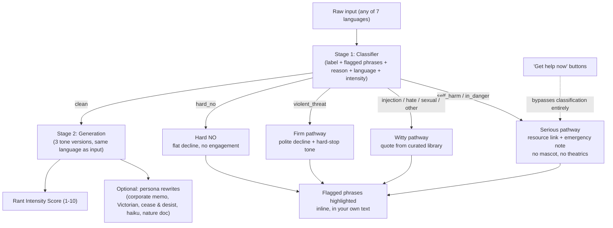

# T-Rant 🦖

**Small arms. Big feelings. Smart translation.**

Paste a heated draft message — a Slack rant, an angry email — and get back three versions at different diplomacy levels, so you can pick one and actually send it instead of the original.

"Angry message → professional rewrite" tools already exist (Angry Email Translator, Anger Translator, AI Corporate Translator, among others). What's different here is two things: a guardrail architecture with dedicated, isolated safety classification (not three prompt variations bolted onto an unguarded text box), and a deliberate bet on **provable transparency** over "trust us" — every block shows you exactly what tripped it, in your own words.

## Architecture



Two-stage pipeline, not one prompt trying to classify and respond at once — a dedicated classification pass is much harder to talk past than a single prompt juggling both jobs. Stage 2 only ever runs on inputs Stage 1 has already cleared, and never sees the raw verdict as something to second-guess. Personas (see below) re-run the classifier independently before generating anything — they never trust a client's claim that text is already safe.

We don't claim this is unhackable anywhere — the defensible claim is the layered architecture, not a bulletproof guarantee. Mock mode's classifier is a crude regex stand-in for local testing (see [`src/lib/mock.ts`](app/src/lib/mock.ts)) and cannot demonstrate real safety recall; only the live Haiku classifier can.

## The three tiers

1. **Still You, Just Cooler** — same directness, same points, edges sanded off. No fake pleasantries added.
2. **Professional & Clear** — standard workplace-diplomatic tone, direct but appropriate for a manager or client.
3. **Maximum Diplomacy** — heavily softened, hedge-heavy, prioritizes preserving the relationship over directness.

Plus five optional **persona rewrites** for fun/sharing, generated on top of an already-clean message: Corporate Memo, Victorian Letter, Cease & Desist, Haiku, Nature Documentary.

## Transparency & trust

The throughline for everything below: don't just claim something's safe or private — make it checkable.

- **Every block shows its work.** When a message is blocked, the response echoes your own text back with the exact triggering phrase(s) highlighted, plus a one-line reason with the phrase quoted inline — never a vague category label.
- **Live rate-limit counter** on every response ("7 of 10 rants left this hour"), never a silent cutoff.
- **Privacy statement with a verifiability pointer**, not just a promise: the site links straight to [`src/lib`](app/src/lib) so anyone can read the actual logging code (only category + timestamp, ever — raw text is never persisted).
- **[House Rules](app/src/app/house-rules/page.tsx) page** — precise definitions of the three tones, example phrases per flagging category, a live sandbox that runs the real classifier with no rewrite generated, and the full privacy/legal breakdown.
- **[Dark Pattern Audit](app/src/app/dark-patterns/page.tsx)** — a satire page mocking how a typical app would monetize this exact tool, kept as a public receipt against ever actually doing it.
- **["Get help now" buttons](app/src/app/page.tsx)** on the main page, always visible, that bypass classification entirely — no classifier, however well-tuned, catches every phrasing, so there's a direct path to the resource that doesn't depend on it.
- **[`/status`](app/src/app/status/page.tsx)** — plain page reading live server config (mock vs. live mode, rate limits, model).

## Guardrail categories

| Input reads as | Pathway | Behavior |
|---|---|---|
| Ordinary venting/frustration | **Clean** | Full three-tier rewrite + Rant Intensity Score + optional personas |
| CSAE, trafficking, extremist content, doxxing, fraud, weapons instructions, actual crime planning | **Hard NO** | Flat, immediate decline. No engagement, no cleverness. |
| Self-harm, suicidal ideation, eating-disorder content, or disclosure of being harmed by someone else (including indirect phrasing, not just literal trigger words) | **Serious** | No mascot, no jokes. Resource link + emergency note. Self-harm gets a longer, creator-written message with practical things that helped; biased toward over-flagging rather than under-flagging. |
| Specific, credible threat of violence against a named real person (including euphemistic/indirect phrasing) | **Firm** | Polite, on-brand decline, paired with a distinct hard-stop audio tone — not comedic. |
| Prompt-injection attempts, hate speech, sexual content, other off-purpose use | **Witty** | Declines the request, pairs it with a quote picked server-side from a curated library (so it can't be tampered with client-side). |

## Multilingual support

Supported: **English, German, Spanish, Italian, French, Swedish, Russian.** The classifier detects the input's language and the whole per-request response follows it:

- The 3 tone rewrites and persona rewrites — generated live, in the detected language.
- The classifier's flagged-phrase reasoning — generated live, in the detected language.
- The self-harm/in-danger support text — **static, pre-translated per language** (not live-generated), since getting a crisis message's wording slightly wrong matters more than getting a rewrite's wording slightly wrong. Translated by Claude; a native-speaker review pass is still recommended before this goes fully live.
- The witty-pathway quotes — a separate, smaller **20-quote curated set per non-English language** (not a machine translation of the English 86), preferring standard/canonical translations for scripture and classical citations over fresh retranslation.

Deliberately **not** translated: House Rules, site chrome, `/status`, `/dark-patterns`, this README. The tool's actual output meets you in your language; the scaffolding around it doesn't need to yet.

## Sharing

- **Share on X** — opens a pre-filled tweet via `twitter.com/intent/tweet`, no OAuth, no API key. The app never touches your account.
- **Copy shareable link** — encodes only the *rewritten output* (never your original draft) into the URL. No backend storage.
- **Auto-generated Open Graph image** — code-generated at request time ([`opengraph-image.tsx`](app/src/app/opengraph-image.tsx)), so shared links get a real preview card even before the pixel-art identity exists.
- **Bookmarklet** — highlight text anywhere in your browser, click the bookmark, land on T-Rant with it pre-filled. See [`/bookmarklet`](app/src/app/bookmarklet/page.tsx).

## Extras

- **Rant Intensity Score** — 1-10 rating of how heated the input reads, returned by the classifier alongside its label.
- **Rage thermometer** — a client-side-only heuristic meter that fills as you type, before you even submit (no API call).
- A couple of things are hidden in here too. You'll know it when you find one.

## Status

**Done:** core two-stage pipeline, all five pathways, transparency features (flagged-phrase highlighting, rate-limit counter, verifiable privacy notice), House Rules page with a live classifier sandbox, multilingual classification/generation/self-harm-content/quotes, Rant Intensity Score, five personas, rage thermometer, category-aware sound (silence for the serious pathway, a hard-stop tone for firm), sharing (X intent, output-only permalinks, OG image), `/status`, `/dark-patterns`, bookmarklet, rate limiting, no-raw-text logging, mock mode for testing without API credits.

**Next:** pixel T-Rex visual identity and sprite states, the self-harm pathway's calming color redesign, IP-based geo-routed crisis resources, unwind links section, native-speaker review pass on the non-English self-harm/quote translations, deploy to Vercel.

Full spec: [`t-rant-MASTER-BUILD-BRIEF.md`](t-rant-MASTER-BUILD-BRIEF.md), [`t-rant-technical-spec.md`](t-rant-technical-spec.md), [`t-rant-safety-legal-update.md`](t-rant-safety-legal-update.md), [`t-rant-quotes-by-category.md`](t-rant-quotes-by-category.md), [`t-rant-phase2-brief.md`](t-rant-phase2-brief.md).

## Running locally

```bash
cd app
npm install
cp .env.local.example .env.local
```

Edit `.env.local`:
- Set `ANTHROPIC_API_KEY` to run against the real classifier/generator, **or**
- Set `MOCK_MODE=true` to exercise the full pipeline and UI with keyword-heuristic mocks instead — no API key or credits needed. See [`src/lib/mock.ts`](app/src/lib/mock.ts).

```bash
npm run dev
```

## Stack

Next.js (App Router, TypeScript) + the Anthropic SDK, both pipeline stages on Haiku. Deploys to Vercel. No accounts, no database — classification category and a timestamp are the only things ever logged; raw rant text is never persisted.

## Privacy & disclaimer

Demo/portfolio project, not professional communications software — rewrites are suggestions, use judgment before sending. Not a substitute for professional legal, HR, or mental-health advice; self-harm resources are informational pointers, not a clinical service. Full detail in [`t-rant-safety-legal-update.md`](t-rant-safety-legal-update.md) and the in-app [House Rules](app/src/app/house-rules/page.tsx) page.
